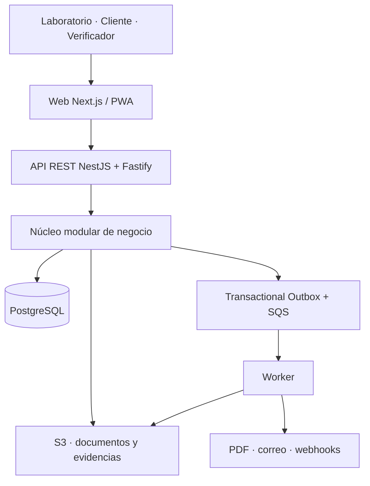

# Ardenfold — Arquitectura y stack técnico

**Estado:** decisión base aprobada  
**Última actualización:** 20 de septiembre de 2026

## 1. Contexto técnico

Ardenfold es una plataforma multiempresa y futura red de confianza para activos físicos, empresas técnicas, trabajos y certificados. Su primer mercado es la calibración, el ensayo y la inspección técnica en Latinoamérica.

El sistema debe permitir que laboratorios, proveedores y empresas propietarias de activos trabajen dentro de una misma plataforma sin perder aislamiento, trazabilidad ni control sobre la información.

## 2. Estilo arquitectónico

Ardenfold comenzará como un **monolito modular multiempresa, API-first y preparado para eventos**.

No se utilizarán microservicios al inicio. La aplicación tendrá módulos de negocio independientes dentro de un mismo sistema, con límites explícitos y comunicación controlada. Estos límites permitirán extraer un módulo como servicio independiente en el futuro solamente si la escala o las necesidades operativas lo justifican.

La aplicación se desplegará mediante tres procesos principales:

1. **Web:** interfaz pública, plataforma operativa, portal de clientes y verificación pública.
2. **API:** operaciones síncronas, autorización y ejecución de casos de uso.
3. **Worker:** generación de documentos, correos, recordatorios, importaciones, webhooks y otros procesos asíncronos.

Los tres procesos pertenecerán al mismo repositorio y compartirán el núcleo del negocio.

## 3. Principios arquitectónicos

- TypeScript estricto de extremo a extremo.
- Reglas del negocio independientes de HTTP, frameworks y proveedores cloud.
- PostgreSQL como fuente principal de verdad.
- Datos técnicos y certificados almacenados de forma estructurada.
- PDFs tratados como representaciones generadas, no como fuente primaria.
- Separación multiempresa aplicada en la aplicación y en PostgreSQL.
- Procesos asíncronos idempotentes y reintentables.
- Auditoría append-only para operaciones sensibles.
- Versiones emitidas de certificados inmutables.
- Integraciones mediante API REST, webhooks y eventos.
- Infraestructura reproducible mediante código.
- Complejidad incorporada solamente cuando exista una necesidad real.

## 4. Topología lógica



## 5. Módulos de dominio

### Identity & Access

Usuarios, organizaciones, sedes, membresías, invitaciones, roles, permisos, sesiones e identidades externas. Un usuario podrá pertenecer a varias organizaciones.

### Parties

Empresas, laboratorios, proveedores, clientes, contactos, direcciones y relaciones comerciales. Una organización podrá cumplir distintos roles según la operación.

### Asset Registry

Identidad persistente de equipos e instrumentos, fabricante, modelo, serie, ubicación, propietario, custodio, estado, fotografías, documentación, QR e historial.

La relación entre una organización y un activo se modelará explícitamente. No se asumirá que un activo sólo puede ser visible para una empresa durante toda su vida.

### Commercial

Solicitudes de servicio, alcances técnicos, cotizaciones versionadas, aceptación, órdenes de compra, precios, impuestos y condiciones comerciales.

### Operations

Recepción, cadena de custodia, órdenes de trabajo, asignación técnica, programación, observaciones, incidentes y transiciones de estado.

### Technical Execution

Procedimientos, magnitudes, unidades, patrones, condiciones ambientales, puntos de medición, resultados, incertidumbre, tolerancias, reglas de decisión y conformidad.

Los valores metrológicos se almacenarán mediante tipos decimales precisos. No se utilizarán números de punto flotante de JavaScript para resultados críticos.

### Certificates & Trust

Certificados estructurados, versiones inmutables, representaciones PDF, hashes, QR de verificación, estados de validez, reemplazo o revocación, evidencias y futuras exportaciones a Digital Calibration Certificate.

### Documents

Metadatos, permisos, checksums, versiones y retención de archivos. Los binarios se almacenarán en object storage y no en el disco de los servidores ni directamente dentro de PostgreSQL.

### Notifications & Integrations

Correos, recordatorios, webhooks firmados, importaciones, exportaciones e integraciones futuras con ERP, QMS y otros sistemas.

### Audit

Registro append-only del actor, organización, acción, entidad, fecha, IP, dispositivo, correlation ID, cambio realizado y motivo cuando corresponda.

## 6. Arquitectura multiempresa

Ardenfold utilizará inicialmente un modelo pooled: las organizaciones compartirán la infraestructura y la base de datos, manteniendo separación lógica y de seguridad.

- Las tablas privadas incluirán `organization_id` o relaciones de acceso equivalentes.
- La API comprobará membresías, roles y permisos.
- PostgreSQL aplicará Row-Level Security en las tablas sensibles.
- La conexión de la aplicación no será propietaria de las tablas ni podrá omitir RLS.
- Cada transacción establecerá el contexto de la organización activa.
- El acceso entre organizaciones se realizará mediante relaciones o grants explícitos.
- Las claves únicas e índices incorporarán el alcance de organización cuando corresponda.
- Existirán pruebas automáticas específicas contra fugas entre organizaciones.

## 7. Persistencia, eventos y consistencia

PostgreSQL será la fuente de verdad para operaciones, estados y auditoría.

Las operaciones críticas que necesiten producir un evento escribirán el cambio de negocio y el registro de outbox dentro de la misma transacción. Un proceso publicará posteriormente el evento en la cola. Los consumidores deberán ser idempotentes.

No se utilizará event sourcing completo. El sistema conservará estado relacional actual y un historial de auditoría separado.

## 8. API e integraciones

- API REST versionada bajo `/api/v1`.
- Contrato documentado mediante OpenAPI.
- Cliente TypeScript generado para web y futura aplicación móvil.
- Idempotency keys para operaciones externas repetibles.
- Webhooks firmados con registro de intentos y reintentos.
- Server-Sent Events para progreso o actualizaciones unidireccionales cuando sea necesario.
- GraphQL y WebSockets no formarán parte de la base inicial.

## 9. Aplicación móvil

La primera versión será una web responsive instalable como PWA.

Se incorporará una aplicación móvil con Expo y React Native cuando el trabajo de campo requiera funcionamiento offline, captura intensiva de fotografías, escaneo de QR, almacenamiento local y sincronización posterior. La app utilizará la misma API y sus contratos públicos.

## 10. Estructura del monorepo

```text
ardenfold/
├── apps/
│   ├── web/
│   ├── api/
│   ├── worker/
│   └── mobile/              # futuro
├── packages/
│   ├── core/
│   ├── database/
│   ├── contracts/
│   ├── ui/
│   ├── observability/
│   ├── config/
│   └── test-utils/
├── infrastructure/
│   ├── terraform/
│   └── docker/
├── docs/
│   ├── architecture/
│   ├── adr/
│   └── domain/
├── package.json
├── pnpm-workspace.yaml
└── turbo.json
```

`packages/core` contendrá reglas, entidades y casos de uso sin dependencias de Next.js, NestJS, HTTP ni AWS. Los adaptadores de API, persistencia y servicios externos dependerán del núcleo, no al revés.

## 11. Stack aprobado

| Área | Tecnología |
| --- | --- |
| Lenguaje | TypeScript estricto |
| Runtime | Node.js en versión LTS activa |
| Monorepo | pnpm Workspaces + Turborepo |
| Frontend | Next.js App Router + React |
| UI | Tailwind CSS + Radix UI/shadcn como base |
| Estado remoto | TanStack Query |
| Formularios | React Hook Form + Zod |
| Tablas | TanStack Table |
| Backend | NestJS con adaptador Fastify |
| API | REST versionada + OpenAPI |
| Base de datos | PostgreSQL |
| Acceso a datos | Drizzle ORM + SQL explícito |
| Migraciones | Drizzle Kit y migraciones SQL revisables |
| Precisión decimal | PostgreSQL `NUMERIC` + librería decimal en dominio |
| Autenticación | Proveedor administrado compatible con OIDC |
| Autorización | RBAC y permisos propios de Ardenfold |
| Archivos | Amazon S3 mediante cargas firmadas |
| Cola | Amazon SQS |
| Consistencia de eventos | Transactional Outbox |
| Tiempo real inicial | Server-Sent Events |
| Correo | Resend inicialmente |
| Generación de PDF | HTML/CSS renderizado con Playwright desde el worker |
| Logging | Pino estructurado |
| Observabilidad | OpenTelemetry + Sentry; CloudWatch en AWS |
| Pruebas unitarias e integración | Vitest + Testcontainers |
| Pruebas frontend | Testing Library |
| Pruebas end-to-end | Playwright |
| Contenedores | Docker + Docker Compose local |
| Producción | AWS ECS Fargate |
| Base administrada | Amazon RDS for PostgreSQL |
| CDN y entrega | CloudFront |
| Infraestructura como código | Terraform |
| CI/CD | GitHub Actions |
| Secretos de producción | AWS Secrets Manager o SSM Parameter Store |
| Aplicación móvil futura | Expo + React Native + SQLite local |

## 12. Tecnologías fuera de la base inicial

No se incorporarán inicialmente microservicios, Kubernetes, Kafka, blockchain, MongoDB, GraphQL, event sourcing completo, Redis obligatorio, Elasticsearch/OpenSearch ni una base de datos independiente por organización.

Estas tecnologías sólo podrán incorporarse mediante una decisión arquitectónica documentada y respaldada por una necesidad medida.

## 13. Internacionalización

Ardenfold será una plataforma multilenguaje desde su estructura inicial.

- Ningún texto visible para el usuario se escribirá directamente dentro de los componentes.
- La aplicación utilizará claves de traducción.
- Los catálogos de idioma se cargarán dinámicamente.
- El idioma se resolverá usando la preferencia del usuario, la configuración de su organización o las preferencias del navegador.
- No se establecerá un idioma comercial permanente como idioma principal del producto.
- Las traducciones incompletas deberán detectarse antes de producción.
- Los datos escritos por usuarios conservarán su idioma original y no serán traducidos automáticamente.
- Fechas, horas, números, monedas y unidades respetarán la configuración regional activa.