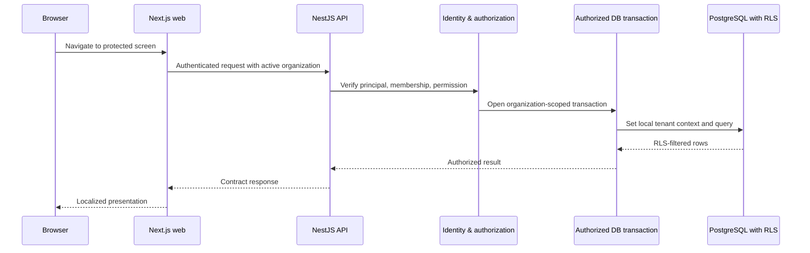
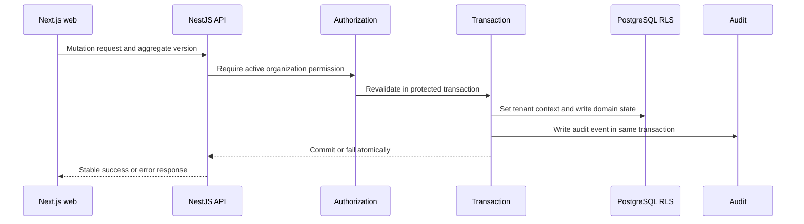
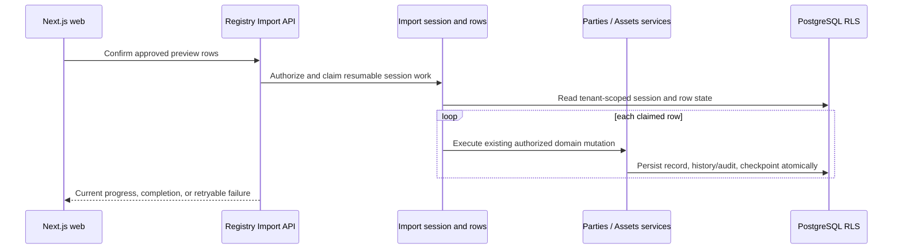

# Ardenfold living system map

This is the canonical navigation map for the implemented Ardenfold system. It
describes current ownership and dependency direction, not planned modules.

For placement and dependency rules when changing it, read the
[contribution boundaries](contribution-boundaries.md).

## System at a glance

```text
Browser
  -> apps/web (Next.js routes and authenticated server adapters)
  -> apps/api (NestJS HTTP, authentication, authorization, applications)
  -> packages/database (authorized transaction, tenant context, PostgreSQL RLS)
  -> PostgreSQL (tenant-scoped domain state, audit, business history)

Shared foundations
  packages/contracts       schemas, types, OpenAPI registration
  packages/ui              reusable presentational primitives
  packages/observability  correlation and structured observability
  packages/test-utils      common test infrastructure
```

`apps/web` improves presentation and forwards authenticated requests; it is not
an authorization boundary. `apps/api` owns authorization and protected use
cases. `packages/database` owns persistence definitions, migrations, tenant
context, and RLS. PostgreSQL is the authoritative data owner.

## Runtime flows

### Authenticated read



### Protected mutation



### Registry import commit



Preview never writes party or asset aggregates. Commit routes each approved row
through the existing application services, preserving their validation,
authorization, audit, concurrency, and RLS guarantees.

## Product domains

| Domain | Owner and entry points | Authoritative data and public surface | Read next |
| --- | --- | --- | --- |
| Identity & Access | `apps/api/src/auth`; authentication, authorization, organization-context and resource HTTP controllers | organizations, sites, memberships, invitations, local roles and permissions; auth/organization contracts | [boundaries](../domain/boundaries.md), [tenant isolation](../development/tenant-isolation.md) |
| Parties | `apps/api/src/parties`; `PartiesController`, management and details services | tenant-scoped parties, roles, identifiers, contacts, channels and addresses; party contracts | [registry model](../domain/parties-and-asset-registry.md) |
| Asset Registry | `apps/api/src/assets`; `AssetsController`, asset management and relationships services | tenant-scoped assets, typed identifiers, lifecycle, archival state, temporal relationships and business history; asset contracts | [registry model](../domain/parties-and-asset-registry.md) |
| Registry Import | `apps/api/src/registry-imports`; `RegistryImportsController`, `RegistryImportService` | tenant-scoped import sessions, parsed rows, validation, progress and error output; registry-import contracts | [import testing](../testing/registry-imports.md) |
| Service Management requests | `apps/api/src/service-management/requests`, `http/service-requests.controller.ts`; `packages/database/src/schema/service-management/requests.ts` | authorized request creation, listing, edits and terminal transitions; tenant-scoped scope and business history | [service model](../domain/service-management.md) |
| Service Management quotation persistence | `packages/database/src/schema/service-management/quotations.ts` | tenant-scoped quotes, numbered draft and immutable issued revisions, exact decimal amounts and historical snapshots; application workflows follow in #94 | [service model](../domain/service-management.md) |

The web route and adapter entry points are under `apps/web/src/app` and the
feature folders `apps/web/src/features/assets`, `parties`, `registry-imports`, and
`service-management/requests`. They consume the public contracts; they do not
own domain rules.

## Platform and shared foundations

| Area | Owner | Responsibility |
| --- | --- | --- |
| Authentication and authorization | `apps/api/src/auth` | verifies identity, resolves active organization, requires permissions, and revalidates protected operations |
| Audit | `apps/api/src/audit` and database audit schema | append-only security and operational accountability, distinct from asset business history |
| Database and tenant isolation | `packages/database/src/schema`, migrations, API database module | schemas, constraints, composite tenant references, transaction-local context, forced RLS, and runtime grants |
| Contracts | `packages/contracts/src` | Zod request/response schemas, inferred types, and OpenAPI metadata consumed by API and web |
| Observability | `packages/observability/src`, API observability module | correlation and structured telemetry support |
| UI | `packages/ui/src` | reusable presentational components; domain behavior remains in owning applications |
| Tests | `apps/e2e`, source-adjacent tests, database testing | browser, API, PostgreSQL/RLS, factories, and platform security evidence |

Dependencies point toward shared foundations: product modules may consume
contracts, database, observability, UI, and test utilities. A product module
must not bypass another module's protected application behavior by writing its
tables directly when an authoritative service owns that workflow.

## Where do I change X?

| Change | Start here |
| --- | --- |
| Asset identifiers, profile, lifecycle, archive | `apps/api/src/assets/management/asset-management.service.ts`, `packages/contracts/src/assets.ts`, `packages/database/src/schema/assets.ts` |
| Asset ownership, custody, or location | `apps/api/src/assets/relationships/asset-relationships.service.ts`, `history/asset-history.writer.ts`, `packages/database/src/schema/asset-history.ts` |
| Asset business history | `apps/api/src/assets/history/asset-history.writer.ts`; do not use the audit module for domain-history changes |
| Party contacts or addresses | `apps/api/src/parties/management/party-management.service.ts`, `packages/contracts/src/parties.ts`, `packages/database/src/schema/parties.ts` |
| Organization membership or invitations | `apps/api/src/auth/memberships`, `apps/api/src/auth/invitations`, and their resource controllers in `auth/http` |
| Permission or organization authorization | `apps/api/src/auth/authorization`, permission contracts, and database authorization schema |
| RLS, tenant context, constraints, or migrations | `packages/database/src/schema/`, `packages/database/drizzle/`, and [tenant isolation](../development/tenant-isolation.md) |
| API schemas and OpenAPI | owning module in `packages/contracts/src`, then `apps/api/src/http/openapi.ts` |
| Web presentation | route composition in `apps/web/src/app`; feature UI/adapters in `apps/web/src/features/assets`, `parties`, or `registry-imports` |
| CSV import parsing, preview, commit, and recovery | `apps/api/src/registry-imports/workflow/registry-import.service.ts`, `parsing/import-parser.ts`, `apps/web/src/features/registry-imports`, and `packages/contracts/src/registry-imports.ts` |
| Service Request persistence and RLS | `packages/database/src/schema/service-management/requests.ts`, `packages/database/src/service-management/requests/requests.test.ts` |
| Quote and revision persistence and RLS | `packages/database/src/schema/service-management/quotations.ts`, `packages/database/src/service-management/quotations/quotations.test.ts` |
| Service Request API and contracts | `apps/api/src/service-management/requests`, `apps/api/src/service-management/http/service-requests.controller.ts`, `packages/contracts/src/service-management/requests/requests.ts` |
| Service Request web intake and lifecycle | `apps/web/src/features/service-management/requests`; routing under `app/[locale]/(app)/app/service-requests` and `app/auth/service-requests` |

## Finding proof

- API and web behavior tests live next to their owners or in `apps/e2e`.
- PostgreSQL constraints and RLS are exercised by database integration suites
  and the platform-security tests described in
  [platform security](../testing/platform-security.md).
- Registry import isolation and recovery coverage is described in
  [registry imports](../testing/registry-imports.md).
- ADRs record durable decisions; current path ownership belongs in this map.

## Future concepts

The [Service Management implementation model](../domain/service-management.md)
is the canonical M4 design and intended capability map for requests, quotations,
acceptance, work orders/items and receipts. The request API and persistence are
implemented, including web request intake, review, editing and terminal
transitions. Quotation persistence is implemented; its application and web
workflows remain future work. The target keeps API application capabilities separate from HTTP and module composition, web
behavior under `apps/web/src/features/service-management`, and contracts and
persistence under their existing package owners. Its boundary ends at readiness
for future Technical Operations.

Do not create folders or contracts for unimplemented quotations, work orders,
technical execution, certificates, documents, notifications, integrations, or
mobile/offline workflows merely to mirror the product vision. Add a bounded
module only when a scoped implementation needs
one.
